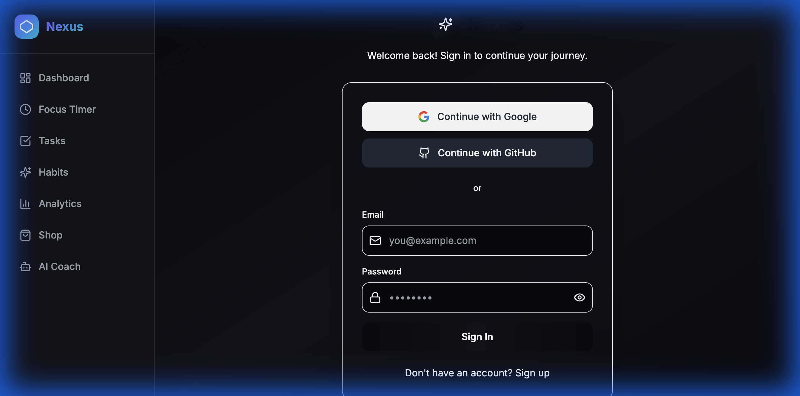
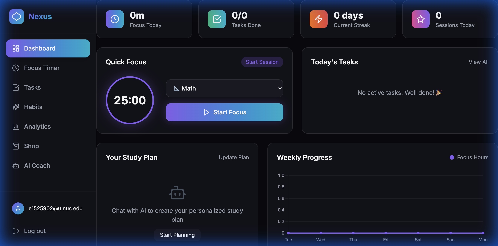
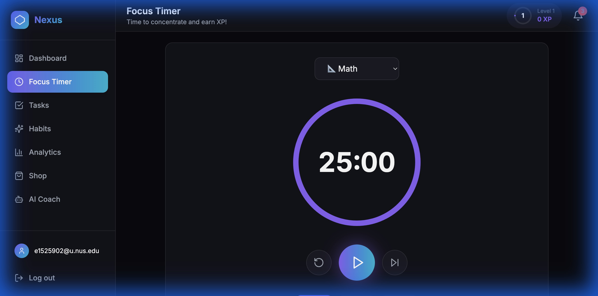
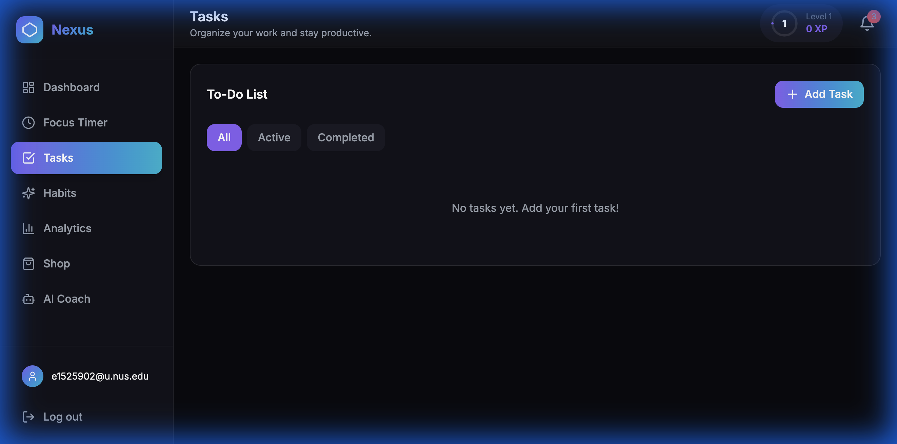
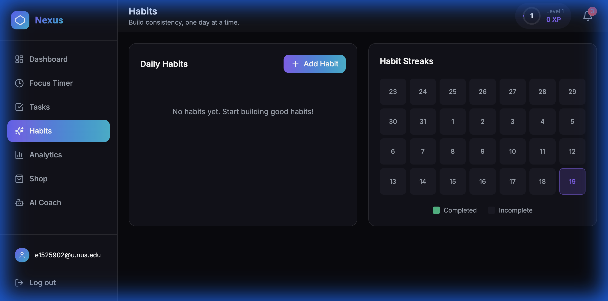
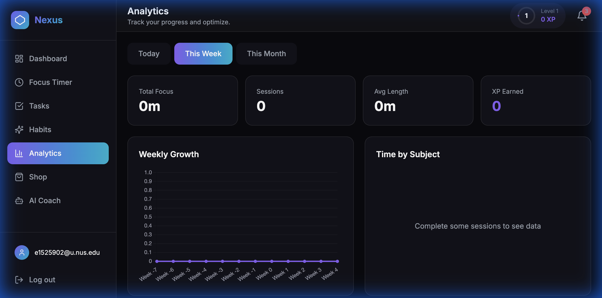
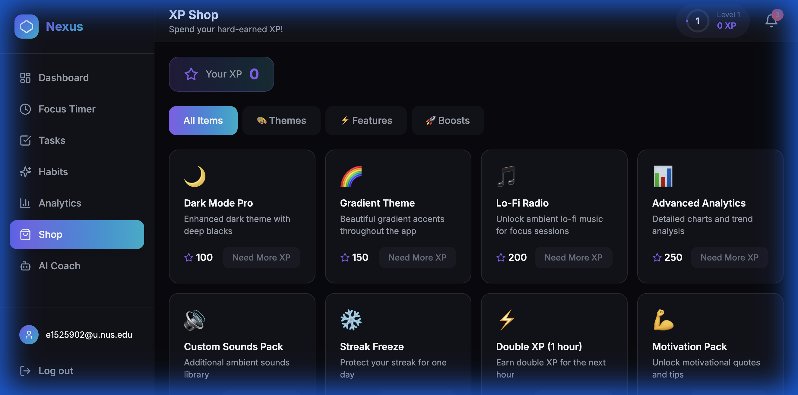
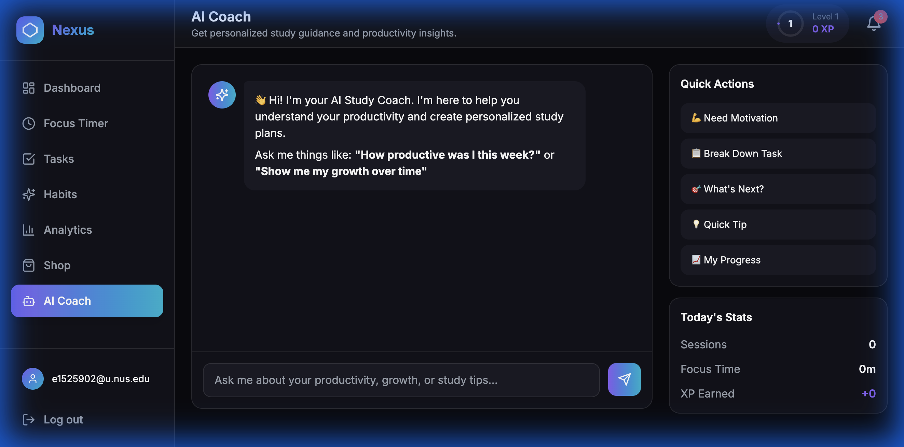

# Nexus - Student Productivity Companion Walkthrough

A comprehensive guide to using Nexus, an AI-powered productivity application designed specifically for students.

## 🔐 Login & Authentication

Nexus offers multiple authentication methods for easy access:

**Login Options:**
- **Continue with Google** - Quick OAuth login with your Google account
- **Continue with GitHub** - Perfect for student developers
- **Email/Password** - Traditional sign-in method

> [!TIP]
> New users can click "Sign up" to create an account using any of these methods.

---

## 📊 Dashboard Overview

After logging in, you'll see your personalized dashboard:

**Key Elements:**
| Section | Purpose |
|---------|---------|
| **Focus Today** | Track total focus time for the day |
| **Tasks Done** | Monitor completed vs. total tasks |
| **Current Streak** | Maintain your productivity streak |
| **Sessions Today** | Number of completed focus sessions |
| **Quick Focus** | Start a Pomodoro session instantly |
| **Weekly Progress** | Visualize your focus hours over the week |
| **Your Study Plan** | AI-generated personalized study schedule |

**How It Helps Students:**
- Get an instant overview of your productivity metrics
- Start studying immediately with the Quick Focus widget
- Track weekly consistency to build study habits

---

## ⏱️ Focus Timer

The Pomodoro-style Focus Timer helps students concentrate:

**Features:**
- **25/50/90 minute presets** - Choose based on your task complexity
- **Subject tracking** - Tag sessions (Math, Science, English, etc.)
- **XP rewards** - Earn experience points for completed sessions
- **Visual countdown** - Large circular timer for easy viewing

**How It Helps Students:**
- Breaks study time into manageable chunks
- Reduces procrastination with structured sessions
- Tracks which subjects you study most

---

## ✅ Task Management

Organize your homework, assignments, and study goals:

**Features:**
- **Add Task button** - Create new tasks with priority levels
- **Filter tabs** - View All, Active, or Completed tasks
- **Task completion** - Mark tasks as done with a click

**How It Helps Students:**
- Never forget assignments or deadlines
- Prioritize urgent vs. important tasks
- Feel accomplished as you check off items

---

## 📅 Habit Tracking

Build consistent study habits with daily tracking:

**Features:**
- **Daily Habits list** - Create habits like "Study for 1 hour" or "Review notes"
- **Add Habit button** - Quickly add new habits to track
- **Habit Streaks calendar** - Visual calendar showing completion history
- **Completed/Incomplete indicators** - Green for done, gray for pending

**How It Helps Students:**
- Build long-term study routines
- Visualize your consistency over weeks
- Stay motivated with streak tracking

---

## 📈 Analytics

Understand your productivity patterns with detailed insights:

**Features:**
- **Time period filters** - View Today, This Week, or This Month
- **Total Focus** - Accumulated study time
- **Sessions** - Number of completed Pomodoro sessions
- **Avg Length** - Average session duration
- **XP Earned** - Gamification progress
- **Weekly Growth chart** - Track improvement over time
- **Time by Subject** - See which subjects get the most attention

**How It Helps Students:**
- Identify peak productivity hours
- Balance study time across subjects
- Track improvement over weeks/months

---

## 🛒 XP Shop (Gamification)

Spend earned XP on rewards and features:

**Available Items:**
| Category | Examples |
|----------|----------|
| **Themes** | Dark Mode Pro, Gradient Theme |
| **Features** | Lo-Fi Radio, Advanced Analytics |
| **Boosts** | Double XP (1 hour), Streak Freeze |

**How It Helps Students:**
- Makes studying feel like a game
- Provides motivation through rewards
- Unlocks premium features through effort

---

## 🤖 AI Coach

Your personal AI study assistant powered by advanced language models:

**What You Can Ask:**
- "How productive was I this week?" → Get stats and insights
- "Show me my growth over time" → Visualize improvement trends
- "Create a study plan for my exam" → Get personalized schedules
- "I need motivation" → Receive encouraging tips
- "Break down this task" → Get task breakdown suggestions

**Quick Actions:**
- 💡 **Need Motivation** - Instant motivational boost
- 📝 **Break Down Task** - Split complex tasks
- ❓ **What's Next?** - Prioritized recommendations
- 💡 **Quick Tip** - Productivity advice
- 📊 **My Progress** - Summary of achievements

**Today's Stats Panel:**
- Sessions completed
- Focus time accumulated
- XP earned today

**How It Helps Students:**
- 24/7 study companion for questions and guidance
- Personalized advice based on your data
- Helps plan and prioritize effectively

---

## 🎯 Summary: How Nexus Helps Students

| Feature | Student Benefit |
|---------|-----------------|
| **Focus Timer** | Structured study sessions prevent burnout |
| **Task Management** | Never miss assignments or deadlines |
| **Habit Tracking** | Build consistent study routines |
| **Analytics** | Understand and improve study patterns |
| **XP Gamification** | Stay motivated through rewards |
| **AI Coach** | Personal tutor available anytime |

---

## 🌐 Live Demo

**Try Nexus now:** [https://frontend-virid-tau-70.vercel.app](https://frontend-virid-tau-70.vercel.app)

---

## 🔧 Technical Stack

| Layer | Technology |
|-------|------------|
| Frontend | Next.js 14 + TypeScript + Tailwind CSS |
| Authentication | Supabase Auth (Google, GitHub, Email) |
| State | Zustand (persisted to localStorage) |
| Charts | Chart.js / react-chartjs-2 |
| Backend | FastAPI (Python) |
| AI | LangChain + OpenAI (gpt-4o-mini) |
